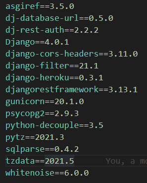

<h1 align="center">TODO TASK APP BACKEND</h1>

  <h3>
    <a href="https://dj-react-todotaskapp-backend.herokuapp.com/">
      Heroku Link
    </a>
  </h3>

## 
FrontEnd ⇒ React.js

## 
BackEnd ⇒ Django

## 
<u>Scenario</u>

### <code>A TODO task application that has the basic task management features, such as create/update/delete tasks along with their groups and assigning the task to one of the system users. The user can create unlimited tasks & task groups as well as move the task between the groups without having to refresh the page to apply the changes.</code>

<code>
  <h3>** Tasks and groups can only be seen by system users. To be a system user it is necessary to register.</h3>
  <h3>** Users can mark the task as a complete task (any completed task moves into the completed tasks group list automatically if the group exists, if not the group will be automatically generated and it will contain the tasks marked as completed inside of it)</h3>
  <h3>** Group scroll functionality after the tasks reach a certain number.</h3>
  <h3>** Sorting in-group can be made in client-side by system users.</h3>
  <h3>** <u>Note:</u> Issue not resolved yet ⇒ As a result of one system user changing the sort criteria, this also changes the tables of all other users.</h3></code>

## 
`<BackEnd Side>`

requirements.txt 

<code>
  <h3>* DataBase ⇨ Sqlite3</h3>
  <h3>* CustomTokenSerializer</h3>
  <h3>* TokenAuthentication</h3>
  <h3>* django.contrib.auth.password_validation</h3>
  <h3>* CreateAPIView, ListAPIView, ModelViewSet</h3>
  <h3>* DjangoFilterBackend</h3>
  <h3>* User from django.contrib.auth.models</h3>
  <h3>* OrderingFilter</h3>
  <h3>* ModelAdmin</h3>
  <h3>* ModelSerializer</h3>
  <h3>* Two Model ⇒ Task and Group </h3>
  <h3>* Two Apps ⇒ users and todo </h3>
  <h3>* env, gitignore files</h3>
  <h3>* corsheaders</h3>
  </code>
